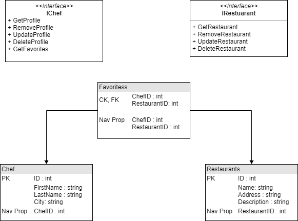

# PraiseProvisionsAPI
An api that returns restaurants, chefs and the chef's recommended restaurants. You would use this API when you need a combination of any of those things. This standalone api lets the user know what restaurants chefs recommend and which cities the restaurants are in.

## API Documentaiton and links
[API Site](https://praiseapi.azurewebsites.net/)

You can use the endpoints:
1. /api/chef - get all chefs
2. /api/favorites - get all favorites
3. /api/recommendations - get all chef recommendations
4. /api/restaurant - get all restaurants

There are some hidden endpoints as well left in there as easter eggs. Feel free to explore them!

[Swagger Documentation](https://app.swaggerhub.com/apis-docs/jimmyn123/PraiseAPI/0.1#/)

## DB Schema

There are two tables and one join table. The chefs table contains all of the chefs and their properties while the restaurants table contains the same for restaurants. The join table represents the many to many relationship between the two tables.

## Tools used
Visual Studio, Swagger

## Contributors
Praise Provisions Team
